# Backend – API REST Fichas de Despiece

API hecha en Laravel para gestionar fichas de despiece de piezas metálicas. Es el backend del proyecto final de ciclo que consume el frontend en React.

---

## Descripción del proyectoLa idea es que una empresa que trabaja con piezas metálicas (aluminio y acero) pueda guardar las fichas de despiece de cada pieza: nombre, material, medidas, cantidad y cliente al que pertenece. También se puede subir un PDF con la ficha técnica.

El backend es una API REST con Laravel 11 que devuelve JSON y consume el frontend en React+TypeScript.

---

## Tecnologías usadas

- PHP 8.x / Laravel 11
- SQLite (desarrollo y testing) / MySQL (producción)
- Laravel Sanctum (autenticación por tokens)
- PHPUnit (testing)

---

## Instalación y puesta en marcha

```bash
# Clonar el repo e ir a la carpeta backend
cd backend

# Instalar dependencias
composer install

# Copiar el .env de ejemplo y configurarlo
cp .env.example .env
php artisan key:generate

# Crear la base de datos SQLite (o configurar MySQL en .env)
touch database/database.sqlite

# Ejecutar migraciones y seeders
php artisan migrate --seed

# Arrancar el servidor
php artisan serve
```

> Si usas MySQL, cambia `DB_CONNECTION`, `DB_DATABASE`, `DB_USERNAME` y `DB_PASSWORD` en el `.env` antes de migrar.

---

## Base de datos y migraciones

El proyecto tiene estas tablas principales:

| Tabla                      | Descripción                                      |
| -------------------------- | ------------------------------------------------- |
| `users`                  | Usuarios de la app (autenticación)               |
| `fichas_despiece`        | Fichas de despiece con medidas y datos de cliente |
| `personal_access_tokens` | Tokens de Sanctum                                 |

Para poblar la base de datos con datos de prueba:

```bash
php artisan db:seed
```

El seeder `FichaDespieceSeeder` crea varias fichas con materiales y clientes de ejemplo.

<!-- CAPTURA: pantalla del TablePlus o similar mostrando las tablas de la BD -->

Users:

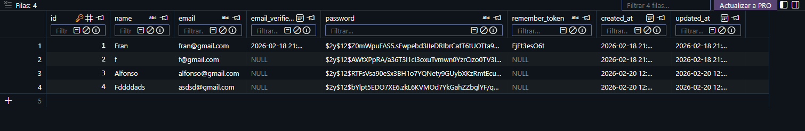

Fichas:

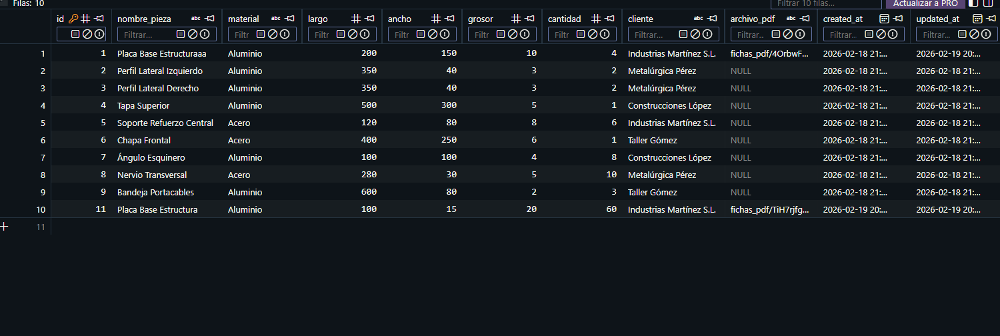

---

## Endpoints de la API

Todos los endpoints van con el prefijo `/api/v1/`.

### Fichas de Despiece

| Método   | Ruta                          | Descripción                 | Auth |
| --------- | ----------------------------- | ---------------------------- | ---- |
| GET       | `/fichas-despiece`          | Listado paginado de fichas   | No   |
| GET       | `/fichas-despiece/{id}`     | Detalle de una ficha         | No   |
| GET       | `/fichas-despiece/{id}/pdf` | Descargar el PDF de la ficha | No   |
| POST      | `/fichas-despiece`          | Crear una nueva ficha        | Sí  |
| PUT/PATCH | `/fichas-despiece/{id}`     | Actualizar una ficha         | Sí  |
| DELETE    | `/fichas-despiece/{id}`     | Eliminar una ficha           | Sí  |

### Ejemplo de respuesta listado paginado

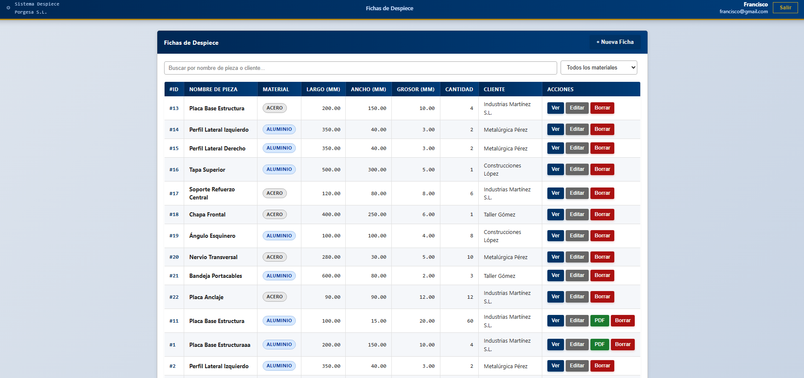


### Ejemplo de respuesta del detalle de una ficha

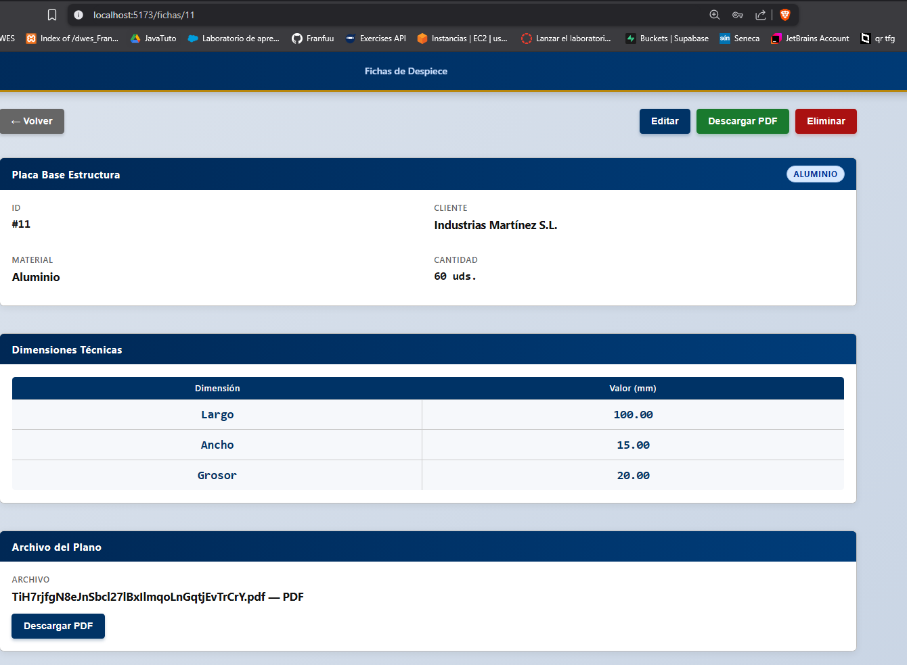

---

## Autenticación con Sanctum

Las rutas de escritura (crear, editar, borrar) están protegidas con `auth:sanctum`. Para usarlas hay que obtener un token primero.

### Registro

```
POST /api/v1/auth/register
```

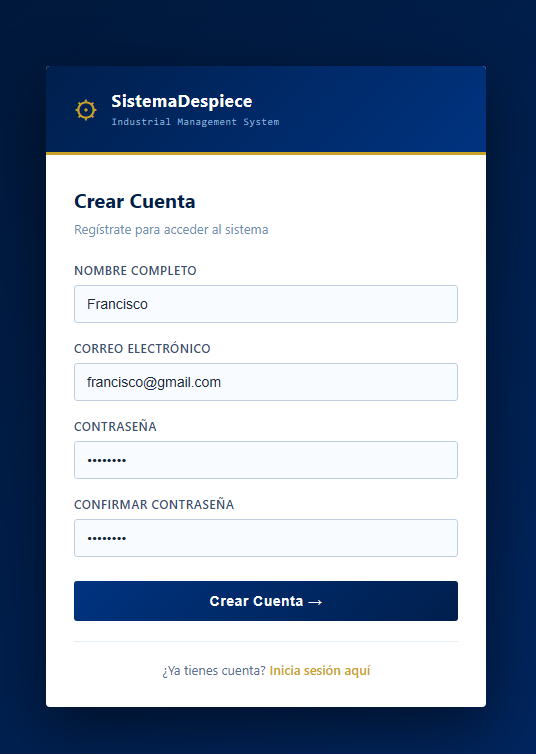

Y como podemos ver se guarda dentro de la base de datos una vez guardamos: 

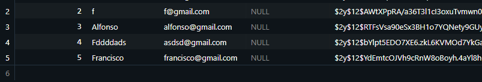

### Login

```
POST /api/v1/auth/login
```

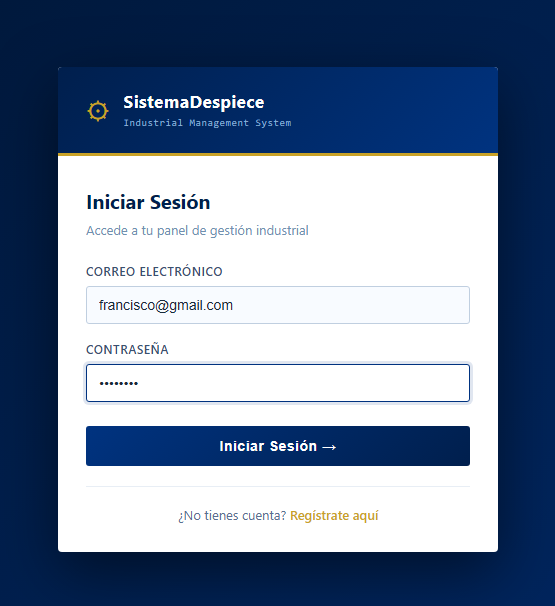

Y ahora nos da paso a la pagina principal ya que se ha iniciado sesion:

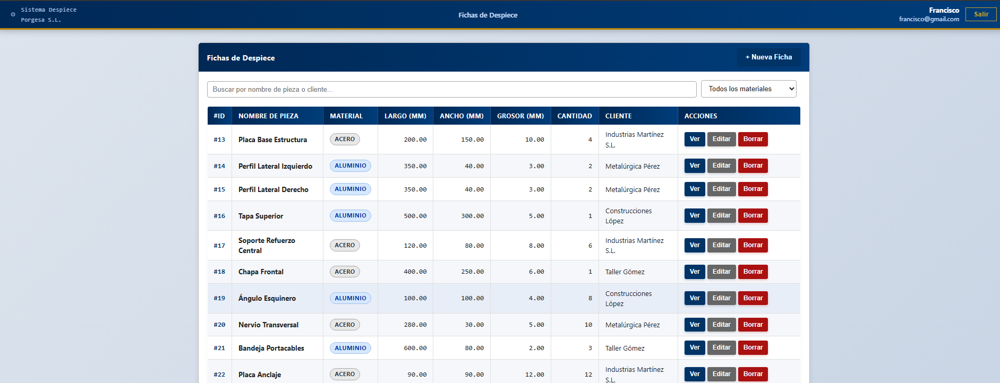

### Logout

Y para cerrar seción simplemente pulsamos el boton de salir, y esto con la autentificacion del bearer token nos saca para la pagina de inicio:


---

## Testing

Esta es la parte que más me ha costado entender al principio pero que tiene mucho sentido una vez te pones con ello.

### Configuración del entorno de testing

El archivo `phpunit.xml` ya está configurado para usar SQLite en memoria durante los tests, así no se toca la base de datos real:

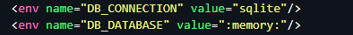

Esto significa que cada vez que se ejecutan los tests se crea una BD en memoria, se migran las tablas y cuando acaban desaparece. Así los tests son independientes y no ensucian datos reales.

En los tests uso el trait `RefreshDatabase` que aplica las migraciones automáticamente antes de cada test:

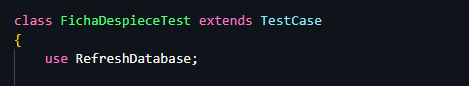

### Tests creados

He creado dos archivos de test en `tests/Feature/`:

#### `FichaDespieceTest.php`

Prueba los endpoints de las fichas de despiece:

| Test                                              | Qué comprueba                                                      |
| ------------------------------------------------- | ------------------------------------------------------------------- |
| `test_get_fichas_despiece_list`                 | El listado devuelve 200 y la estructura JSON correcta               |
| `test_get_ficha_despiece_detail`                | El detalle de una ficha devuelve 200 con los datos correspondientes |
| `test_get_non_existing_ficha_returns_404`       | Pedir una ficha con ID inexistente devuelve 404                     |
| `test_unauthenticated_user_cannot_create_ficha` | Sin token, el POST devuelve 401                                     |
| `test_authenticated_user_can_create_ficha`      | Con token, se crea la ficha y devuelve 201                          |
| `test_authenticated_user_can_delete_ficha`      | Con token, se borra la ficha y devuelve 204                         |
| `test_unauthenticated_user_cannot_delete_ficha` | Sin token, el DELETE devuelve 401                                   |

#### `AuthTest.php`

Prueba el sistema de autenticación:

| Test                                          | Qué comprueba                                        |
| --------------------------------------------- | ----------------------------------------------------- |
| `test_user_can_register`                    | Un usuario nuevo se puede registrar y recibe token    |
| `test_user_can_login`                       | Login con credenciales correctas devuelve 200 y token |
| `test_authenticated_user_can_logout`        | Logout con token válido devuelve 200                 |
| `test_invalid_credentials_return_error`     | Contraseña incorrecta devuelve 422                   |
| `test_cannot_register_with_duplicate_email` | Email duplicado devuelve 422 con error de validación |
| `test_unauthenticated_request_returns_401`  | Logout sin token devuelve 401                         |

### Ejemplo de un test

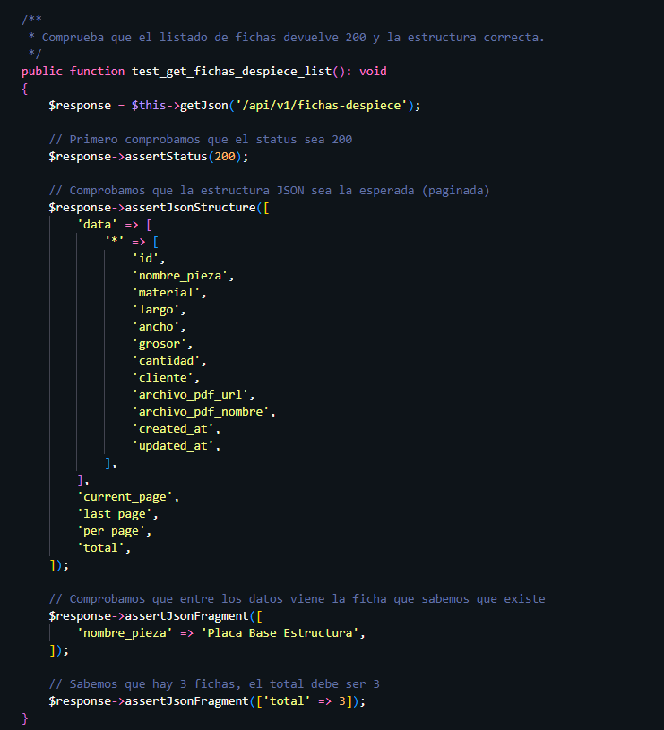

### Ejecutar los tests

```bash
php artisan test
```

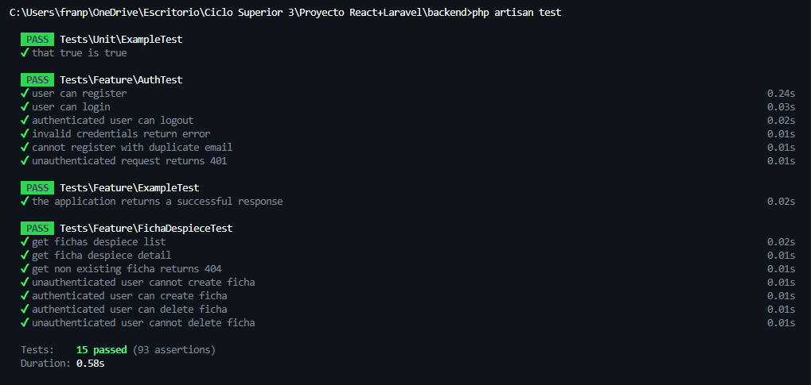

### Qué aprendí con los tests (reflexión personal)

En la UD7 explica que el formato TDD consiste en escribir los tests ANTES de hacer el código. Al principio me parece una locura porque ¿cómo escribes un test de algo que no existe? Pero tiene sentido: primero defines cómo debe funcionar y luego codificas para satisfacer esos tests.

Yo lo apliqué: primero diseñé los tests pensando en cómo debe funcionar la API, y luego fui ajustando el código para que pasasen. Por ejemplo, descubrí que el método `store()` devolvía 200 cuando debería devolver 201 al crear un recurso. Los tests me lo dijeron directamente, sin tener que probarlo a mano.

Sin tests probablemente no lo habría notado hasta que alguien del front me dijese que algo iba raro.
